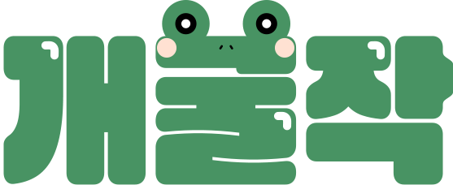
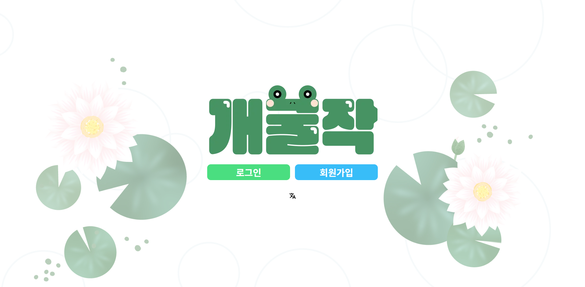
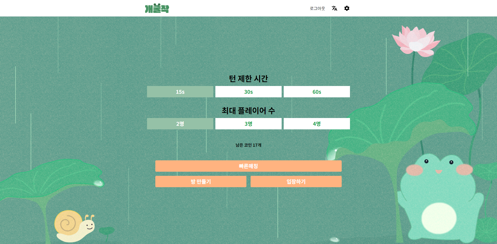
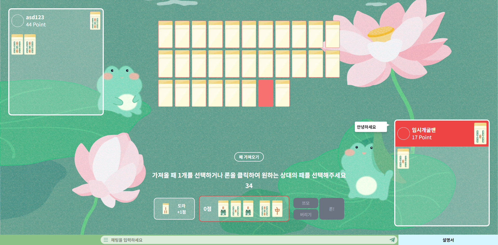
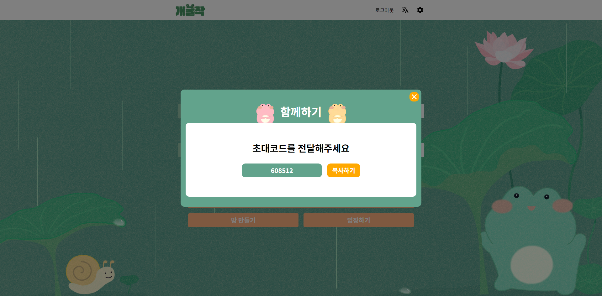

<p align="center">
  
</p>
<p align="center">
    <h1 align="center">FROG-MAHJONG</h1>
</p>
<p align="center">
    <em><code>❯ 보드게임 참새작을 웹으로 구현하였습니다</code></em>
</p>
<p align="center">
	
	
	
</p>
<p align="center">
		<em>Built with the tools and technologies:</em>
</p>
<p align="center">
	
	
	
	
	
	
	
	
</p>

<br>

##### 🔗 Table of Contents

- [📍 Overview](#-overview)
- [👾 Features](#-features)
- [📂 Repository Structure](#-repository-structure)
- [🧩 Modules](#-modules)
- [🚀 Getting Started](#-getting-started)
    - [🔖 Prerequisites](#-prerequisites)
    - [📦 Installation](#-installation)
    - [🤖 Usage](#-usage)
    - [🧪 Tests](#-tests)
- [📌 Project Roadmap](#-project-roadmap)
- [🤝 Contributing](#-contributing)
- [🎗 License](#-license)
- [🙌 Acknowledgments](#-acknowledgments)

---

## 📍 Overview






---

## 👾 Features

[인증] <br/>
로그인: 사용자에게서 필요한 정보를 받아 유효성 검사를 한 후 백엔드로 전송하여 access token과 refresh token을 받아와 쿠키에 저장하도록 구현하였습니다.

회원가입: 이메일 입력과 유효성 검사가 성공하면 인증번호 메일이 발송을 요청하도록 하여 가입시 필요한 정보들과 인증번호를 백엔드에 전송하도록 구현하였습니다.

비밀번호 찾기: 사용자의 이메일을 받아 백엔드로 보내준 후 비밀번호 리셋 페이지로 이동시켜서 받은 이메일의 인증코드와 필요한 정보들을 받아 새로운 비밀번호를 설정할 수 있도록 구현하였습니다.

유효성 검사는 react-hook-form 모듈, 쿠키의 경우 cookies-next 모듈을 활용하였습니다.

[Protected routes]<br/>
인증과 관련된 페이지에 접근을 시도할 경우 refresh token을 보유한 사용자만 접근을 허용하고 없을 경우 로그인 페이지로 리다이렉션 응답이 보내지도록 구현하였습니다.

“/”페이지에가 로그인 한 유저가 접근시에는 redirect기능, 그 외의 페이지에서는 middleware 기능을 활용하였습니다.

[대량의 에셋 처리]<br/>
매칭루트(“/rooms”)와 child route에서 필요한 배경이나 카드들의 이미지가 너무 많아 불러오는 속도가 느려 버벅이는 현상이 발생하였습니다.

매칭루트로 넘어가기 이전 로그인 페이지(구글 로그인의 경우 구글 콜백 페이지)에서 로그인 성공 후 미리 에셋(이미지, 오디오)들을 불러와 브라우저에 캐싱 되도록 구현하였습니다.

불러오는 도중에는 불러온 비율을 알 수 있게 표시하였습니다.

[WebSocket을 이용한 매칭, 게임시스템]<br/>
매칭하기 버튼을 클릭하여 매칭 모달이 열리는 순간 WebSocket 연결을 시작하여 open을 받은 이후부터 message를 주고 받도록 구현하였습니다. 웹소켓 연결과 핸들러를 달아주는 로직은 useQuickMatching.ts 훅으로 관리합니다.

모달이 열리고 매칭완료 정보를 받게되면 게임페이지로 이동되게 됩니다.

message로 주고 받는 이벤트의 내용을 json형태로 정하고 그 안에서도 매칭이나 게임 진행과 관련된 타입을 정하여 게임 정보를 실시간으로 주고 받을 수 있게 구현하였습니다.

게임과 관련된 정보는 zustand를 사용하여 전역상태로 관리합니다.

[다국어 기능]<br/>
UI에 필요한 message 파일들을 kr.json, jp.json등을 별도의 파일로  분리하여 관리하며  사용자가 언어를 설정할 시에는 쿠키를 이용하여 구현하였습니다.

next-intl을 사용하였습니다.

---

## 📂 Repository Structure

```sh
└── frog-mahjong/
    ├── .github
    │   └── ISSUE_TEMPLATE
    ├── README.md
    ├── app
    │   ├── (auth)
    │   ├── (game)
    │   ├── (info)
    │   ├── Header.tsx
    │   ├── error.tsx
    │   ├── favicon.ico
    │   ├── fonts
    │   ├── globals.css
    │   ├── layout.tsx
    │   ├── not-found.tsx
    │   ├── opengraph-image.jpg
    │   ├── page.tsx
    │   ├── robots.ts
    │   └── twitter-image.jpg
    ├── declarations.d.ts
    ├── frog-mahjong.iml
    ├── i18n
    │   └── request.tsx
    ├── messages
    │   ├── jp.json
    │   └── kr.json
    ├── middleware.ts
    ├── next.config.mjs
    ├── package-lock.json
    ├── package.json
    ├── postcss.config.mjs
    ├── public
    │   ├── ads.txt
    │   ├── audios
    │   ├── bg
    │   ├── cards
    │   ├── helps
    │   ├── icons
    │   ├── logos
    │   ├── profiles
    │   └── social-buttons
    ├── tailwind.config.ts
    ├── tsconfig.json
    └── utils
        ├── axios.ts
        ├── components
        ├── constants
        ├── functions
        ├── hooks
        └── stores
```

---
## 🚀 Getting Started

### 📦 Installation

Build the project from source:

1. Clone the frog-mahjong repository:
```sh
git clone https://github.com/kkukileon305/frog-mahjong
```

2. Navigate to the project directory:
```sh
cd frog-mahjong
```

3. Install the required dependencies:
```sh
npm install
```

### 🤖 Usage

To run the project, execute the following command:

```sh
npm run dev
```